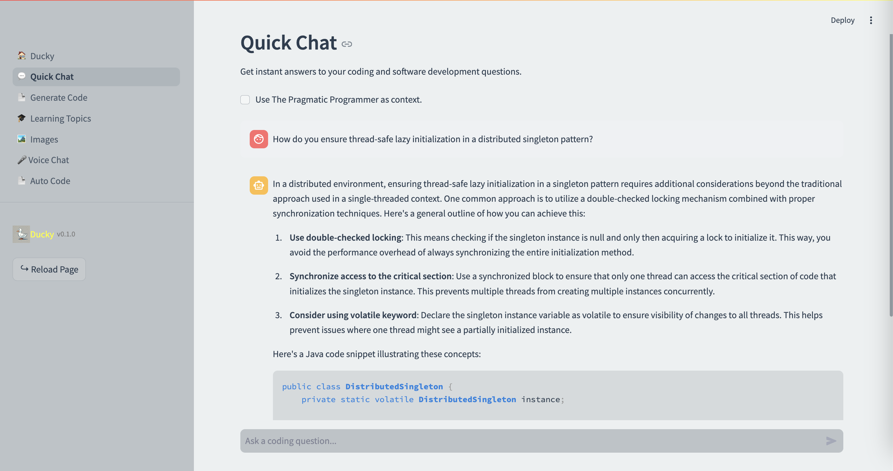
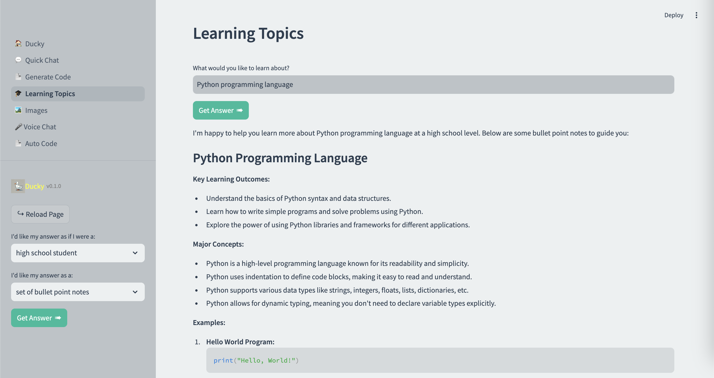

# DuckyAI: Code Assistant

## Project Overview

**DuckyAI** is a generative AI-powered code assistant designed to streamline
software development tasks, from code generation to debugging.
It started as a series of incremental development modules (Modules 1 to 9),
each exploring different aspects of AI and software engineering, culminating
in **Module 10**, which represents the final, fully-integrated product.

## Incremental Development Modules

- **Modules 1 to 9**: Iterative exploration of Python programming, AI tools, and software engineering practices. These modules served as the building blocks, incrementally developing and testing functionalities that would be integrated into the final product.

## Final Module - Module 10

**Module 10** represents the culmination of all previous work.
It delivers a fully integrated, production-ready code assistant with the
following features:

- **Automated Code Review**: Uses AI to review code and suggest improvements.
- **Code Generation**: Generates code snippets based on user input.
- **Bug Detection**: Identifies potential bugs in the code.
- **Documentation Assistance**: Helps in writing and maintaining documentation.
- **Refactoring Suggestions**: Provides suggestions for improving code structure and readability.
- **Task Automation**: Coordinates multiple agents to handle complex tasks.
- **Image Generation & Voice Chat**: Supports image creation features and voice-based interaction.
- **Context Retrieval (e.g., PDF-based)**: Leverages semantic search and external documents to provide context-aware suggestions.

## Snapshots

### Quick Chat



### Learning Topics



### Image Generation


### Documentation Assistance

## Setup

1. **Clone the repository**:

   ```sh
   git clone https://github.com/k-aseem/DuckyAI.git
   cd DuckyAI
   ```

2. **Set up a virtual environment**:

   ```sh
   python3 -m venv venv
   source venv/bin/activate
   # On Windows use `venv\Scripts\activate`
   ```

3. **Install the dependencies**:

   ```sh
   pip install -r requirements.txt
   ```

4. **Install the agent requirements**:
   ```sh
   pip install -r requirements_agents.txt
   ```

## Usage

1. **Activate the virtual environment**:

   ```sh
   source venv/bin/activate
   # On Windows use `venv\Scripts\activate`
   ```

2. **Start the project**:
   ```sh
   streamlit run 🏠_Ducky.py
   ```

## Contributing

Contributions are welcome! Please fork the repository and submit a pull request.

## License

This project is licensed under the MIT License.
