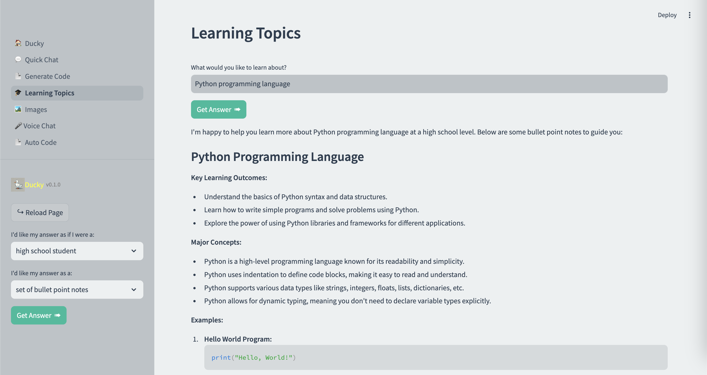

# DuckyAI: Code Assistant

## Project Overview

**DuckyAI** is a generative AI-powered code assistant designed to streamline
software development tasks, from code generation to debugging.

## Features

-   **Automated Code Review**: Uses AI to review code and suggest improvements.
-   **Code Generation**: Generates code snippets based on user input.
-   **Bug Detection**: Identifies potential bugs in the code.
-   **Documentation Assistance**: Helps in writing and maintaining documentation.
-   **Refactoring Suggestions**: Provides suggestions for improving code structure and readability.
-   **Task Automation**: Coordinates multiple agents to handle complex tasks.
-   **Image Generation & Voice Chat**: Supports image creation features and voice-based interaction.
-   **Context Retrieval (e.g., PDF-based)**: Leverages semantic search and external documents to provide context-aware suggestions.

## Snapshots

### Quick Chat


### Learning Topics



### Image Generation


### Documentation Assistance

## Setup

1. **Clone the repository**:

    ```sh
    git clone https://github.com/k-aseem/DuckyAI.git
    cd DuckyAI
    ```

2. **Set up a virtual environment**:

    ```sh
    python3 -m venv venv
    source venv/bin/activate
    # On Windows use `venv\Scripts\activate`
    ```

3. **Install the dependencies**:

    ```sh
    pip install -r requirements.txt
    ```

4. **Install the agent requirements**:

    ```sh
    pip install -r requirements_agents.txt
    ```

5. **Set up OpenAI API Base URL, Key and Model**:

    - Create a .env file in the root directory of the project.
    - Add the following lines to the .env file:

    ```sh
    OPENAI_API_KEY=your_openai_api_key
    OPENAI_BASE_URL=https://api.openai.com/v1
    OPENAI_MODEL=gpt-3.5-turbo
    ```

## Usage

1. **Activate the virtual environment**:

    ```sh
    source venv/bin/activate
    # On Windows use `venv\Scripts\activate`
    ```

2. **Start the project**:
    ```sh
    streamlit run 🏠_Ducky.py
    ```

## Contributing

This is a personal project, but feel free to open issues or pull requests if you try it out and have ideas.

## License

This project is licensed under the MIT License.
